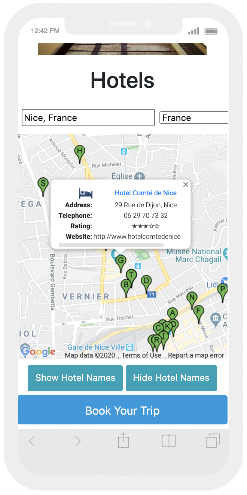
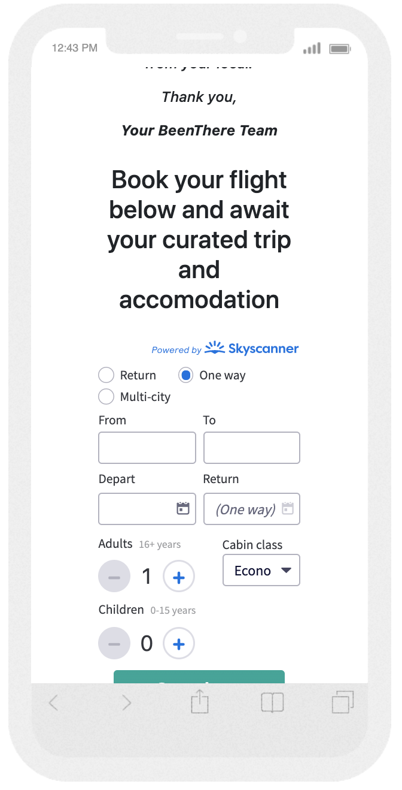

# BeenThere
<b>Problem Statement</b> 
We live in the age of customisation where people want to curate different offerings or products all of the time. They would love to curate their own holiday
so it does not feel like a stale package holiday from the 70s. They do not have the local knowledge when they visit a new place to know all the best places to go to and 
what places to visit. 

 
<b>Proposed Solution</b> 
<i>BeenThere</i> is a website aimed at curating customisable holidays based on the invaluable knowledge of the locals. They know the best
hotels,restaurants and bars to go to, as they have been living there for at least four years. The locals are carefully selected by the BeenThere team and usually have a background in the
hospitality industry or the food industry. 

## UX
The user experience for the website is aimed at providing users the ability to make their first attempt at looking where they want to travel to and looking for what hotels are available, in the city that they want to book in.
As they look at the google maps functionality provided they might then make the decision to actually have a local curate their trip for them, as they look at the five main city destinations and read about the locals who are designing the curated trips this month. 

<b>User Story 1: Be Inspired</b> 
- A new user comes across the <b>BeenThere</b> website when starting to plan their holiday. They do not know where they want to go on holiday yet and would like to be inspired by the 5, monthly cities with the current 3 recommendations for hotels, bars, and restaurants. After they are inspired
they book a curated trip.

<b>User Story 2: Checking which cities are in focus this month and just using the hotel finder</b> 
- As a new or experienced user, the user checks which 5 cities are in focus for the <b>BeenThere</b> team this month, and if they do not want to use the curated trip part of the website, they may choose to use the specialised google map and search functionality from the <b>BeenThere</b> website as
the map has filtered out most other items from it, that does not relate to holiday planning, to choose their hotel and book their trip.  

<b>User Story 3: Booking flight post trip planning</b> 
- After a user has booked their curated trip; They are brought to a 'thank you' page which sets expectations with them that they can expect their curated trip within 48 hours and that they can go ahead and book their flight. 
The booking of the flight is quickly started through the skyscanner widget on the <b>BeenThere</b> website as it is convenient for the user to get the flight booking out of the way.  

## Features
1) <b>Custom google maps for highlighted cities</b>   
Users are able to look for curated trips on a specific city page that include a specially filtered google map that only includes the items that you would need for planning a holiday. This map also includes 3 markers that include the suggestions from the local for the hotel, restaurant and bar that they have
chosen to highlight this month. The markers have even-listeners built in so that when the user clicks on the marker they can read a blurb about the location and also see what it looks like in the picture provided.

2) <b>Request to book form</b>   
After the user has succesfully chosen the city they want to travel to, they can press the 'book your trip' button which brings them to the 'request to book form'
which allows them to highlight all of their choices and requirements for their trip to the <b>BeenThere</b> team so that they have all of the information to plan the trip for the user. The user then presses the 'Submit Request for Ideal Holiday' button which has an
event-listener on it that then thanks them as it loads the next page.

3) <b>Hotel Search google map with search bar</b>   
Users are able to filter the country to the current countries which are in focus this month for the <b>BeenThere</b> team, this will centre the google map on the country in question. The user can then type in the city that they want to book in, this does not have to be part of the cities in focus and it will centre the map on the city they searched for and bring up all of the hotels in the centre of the city.
There is a semi-transparent list type table that they can see as well that lists all of the hotels so that they can quickly have a read through rather than looking at all of the hotels that are distributed on the map. The hotels are labelled with the letters of the alphabet so that the user
can remember which hotel they have already reviewed and can match the letters to the hotel that they can see in the transparent list. If the user clicks on the individual markers for the hotels it will bring up information about the hotel so that the user can book the hotel and also visit the hotel's own website. If they choose not to look at the list and just click on the hotels on the actual map I have built in an event-listener that allows them to hide this semi-tranparent list by pressing the 'hide the search table' button below. 

4) <b>SkyScanner flight booking widget</b>   
After the user requests to book their trip they are brought to a 'post booking' that educates the user that it will take around 48 hours for them to receive their curated trip, underneath that education the user is 'called to action' to book their flight using the
skyscanner widget that is built into that page. It allows the user to choose if they want to book a return, one-way or multi-city ticket, where the flight is going to and coming from, it allows the user to choose the day they want to depart and the day they want to return,
how many adults and children are going and then what class of flight ticket they want to book. They then press the 'search flights' button which brings them to the skyscanner page with the live flight information. The link has a unique referal code built into it though that we will get referral comission on.

## Future Feature Ideas
1) Developing a google sheet that is populated by the form so that the BeenThere-Locals can take their booking-leads directly from the google sheet and it would help with tracking of a kind of start of a CRM system.
2) To add more markers every month to the city maps that give the potential bookers even more of a choice when it comes to getting insights into the city that is in focus that month.
3) Adding more cities and more locals every month.
4) Add a chat functionality so that users can ask questions to the BeenThere team more easily.
5) Add possible restaurant and bar search to the already present hotel search.
6) Figure out, instead of having the skyscanner app, that people could see a live feed of the flight prices at the time to that destination.

## Technologies Used

- [Bootstrap](https://getbootstrap.com/)
    - The project uses **Bootstrap** to speed up the HTML and CSS work.

- [Google Fonts](https://fonts.google.com/)
        - I used archivo as this website is a little bit like an archive of recommended content and ideas. It looks very strong and clean as well as a font.

- [CSS](https://cssreference.io/)

- [Font Awesome](https://fontawesome.com/) 
        - 'fa fa-graduation-cap' - 'fa fa-facebook' - 'fa fa-twitter' - 'fa fa-instagram'

- [Google Maps API](https://developers.google.com/maps/documentation/javascript/tutorial)
        - I used the google maps api to make the custom google maps to filter out all of the noise of the google maps and to leave just the points of interest for holiday planning.
        - The custom markers and pop-up window for the recommended hotel, restaurant and bar were made using google maps api.

- [Google Places API](https://developers.google.com/places/web-service/intro)
        - I used the google places api to create a map and search bar that specifically lets you filter a country, type in a city, and the map then displays all of the hotels in that city.
        - The map also shows a transparent list with the hotel labels so that a user can see quickly where a hotel is located. I built a button that can make this list invisible if the user wishes to concentrate just on the map.
        - The markers of the hotels on the map lets you also click on them and display more information such as name of hotel, website url, and phone number.

## Testing
<b>Testing Summary</b> 

1. a) <b>User Story 1:</b> Be Inspired and book a curated trip.
    1. Try to read all of the text on the index page and make sure that the text looks strong. - Success
    2. The image loads. - Success
    3. Try the 'Curated Trip' button and see if it displays 'choose' and 'city buttons' section. - Success
    4. Try the 'Search for Hotels' button and see if it displays the map and the search bar. - Success
    5. Try entering a city into the search bar and see if the map responds. - Success
    6. Check if the semi-transparent hotel list is there. - Success
    7. Try the 'Hide Search Table' button and see if the hotel list becomes invisible.  - Success
    8. Try moving the map around with hand cursor. - Success
        - Found Social Media buttons floating in the map. I don't want the user going to social media when they are searching for hotels so I just added an event listener to make the social media buttons disappear when the hotels button is pressed.      
    9. 'Curated Trip' button is present and works. - Success
    10. 'Nice' button is present and works. - Success
    11. 'Ibiza' button is present and works. - Success
    12. 'Berlin' button is present and works. - Success
    13. 'Paris' button is present and works. - Success
    14. 'London' button is present and works. - Success 
    15. All five city pictures are present and smoothly transitioning in carousel. - Success 
    16. The social media, font awesome items are present and the hyperlinks are working. - Success
    17. All five city pictures are present and smoothly transitioning in carousel. - Success 
    18. Check the index.html page in responsinator(https://www.responsinator.com/?url=https%3A%2F%2Fsammckenna1986.github.io%2FBeenThere-GoogleMapsApi%2F)
        - Success

1. b) <b>User Story 1:</b> Nice - city page.
    1. Try to read all of the text on the page and make sure that the text looks strong. - Success
    2. The image of Nice and of Adeline load. - Success
    3. Customised map loads. - Success
    4. All three markers load on the map and the map is centred on the markers. - Success
    5. All three event listeners for clicking on the markers are working. - Success
    6. All three markers have working pop-up windows that include the customised text and images. - Success
    7. The 'Book Your Trip' button is present and it is working correctly. - Success
    8. The city buttons underneath the logo are all present and are working correctly. - Success
    9. The hyperlink within the logo is correctly working and brings people back to the index.html page. - Success
    10. The social media, font awesome items are present and the hyperlinks are working. - Success
    12. Check the page in responsinator(https://www.responsinator.com/?url=https%3A%2F%2Fsammckenna1986.github.io%2FBeenThere-GoogleMapsApi%2Fnice.html) - Success

1. c) <b>User Story 1:</b> Ibiza - city page.
    1. Try to read all of the text on the page and make sure that the text looks strong. - Success
    2. The image of Ibiza and of Irene load. - Success
    3. Customised map loads. - Success
    4. All three markers load on the map and the map is centred on the markers. - Success
    5. All three event listeners for clicking on the markers are working. - Success
    6. All three markers have working pop-up windows that include the customised text and images. - Success
    7. The 'Book Your Trip' button is present and it is working correctly. - Success
    8. The city buttons underneath the logo are all present and are working correctly. - Success
    9. The hyperlink within the logo is correctly working and brings people back to the index.html page. - Success
    10. The social media, font awesome items are present and the hyperlinks are working. - Success
    12. Check the page in [responsinator](https://www.responsinator.com/?url=https%3A%2F%2Fsammckenna1986.github.io%2FBeenThere-GoogleMapsApi%2Fibiza.html) - Success

1. d) <b>User Story 1:</b> Berlin - city page.
    1. Try to read all of the text on the page and make sure that the text looks strong. - Success
    2. The image of Berlin and of Sandra load. - Success
    3. Customised map loads. - Success
    4. All three markers load on the map and the map is centred on the markers. - Success
    5. All three event listeners for clicking on the markers are working. - Success
    6. All three markers have working pop-up windows that include the customised text and images. - Success
    7. The 'Book Your Trip' button is present and it is working correctly. - Success
    8. The city buttons underneath the logo are all present and are working correctly. - Success
    9. The hyperlink within the logo is correctly working and brings people back to the index.html page. - Success
    10. The social media, font awesome items are present and the hyperlinks are working. - Success
    11. Check the page in [responsinator](https://www.responsinator.com/?url=https%3A%2F%2Fsammckenna1986.github.io%2FBeenThere-GoogleMapsApi%2Fberlin.html) - Success

1. e) <b>User Story 1:</b> London - city page.
    1. Try to read all of the text on the page and make sure that the text looks strong. - Success
    2. The image of London and of Mildred load. - Success
    3. Customised map loads. - Success
    4. All three markers load on the map and the map is centred on the markers. - Success
    5. All three event listeners for clicking on the markers are working. - Success
    6. All three markers have working pop-up windows that include the customised text and images. - Success
    7. The 'Book Your Trip' button is present and it is working correctly. - Success
    8. The city buttons underneath the logo are all present and are working correctly. - Success
    9. The hyperlink within the logo is correctly working and brings people back to the index.html page. - Success
    10. The social media, font awesome items are present and the hyperlinks are working. - Success
    11. Check the page in [responsinator](https://www.responsinator.com/?url=https%3A%2F%2Fsammckenna1986.github.io%2FBeenThere-GoogleMapsApi%2Flondon.html) - Success

1. e) <b>User Story 1:</b> Paris - city page.
    1. Try to read all of the text on the page and make sure that the text looks strong. - Success
    2. The image of Paris and of Amelie load. - Success
    3. Customised map loads. - Success
    4. All three markers load on the map and the map is centred on the markers. - Success
    5. All three event listeners for clicking on the markers are working. - Success
    6. All three markers have working pop-up windows that include the customised text and images. - Success
    7. The 'Book Your Trip' button is present and it is working correctly. - Success
    8. The city buttons underneath the logo are all present and are working correctly. - Success
    9. The hyperlink within the logo is correctly working and brings people back to the index.html page. - Success
    10. The social media, font awesome items are present and the hyperlinks are working. - Success
    11. Check the page in [responsinator](https://www.responsinator.com/?url=https%3A%2F%2Fsammckenna1986.github.io%2FBeenThere-GoogleMapsApi%2Fparis.html) - Success

1. f) <b>User Story 1:</b> booking.html page.
    1. Try to read all of the text on the page and make sure that the text looks strong. - Success
    2. The large success image loads. - Success
    3. All form elements loaded correctly including placeholders. - Success
    4. The 'which city?' dropdown menu works. - Success
    5. The 'submit request for ideal holiday' button is present and working. - Success
    5. The event listener changes the 'submit request for ideal holiday' button content to 'thank you' on click. - Success
    9. The hyperlink within the logo is correctly working and brings people back to the index.html page. - Success
    10. The social media, font awesome items are present and the hyperlinks are working. - Success
    11. Check the page in [responsinator](https://www.responsinator.com/?url=https%3A%2F%2Fsammckenna1986.github.io%2FBeenThere-GoogleMapsApi%2Fbook.html)
 - Success
    
2. <b>User Story 2:</b> User Story 2: Checking which cities are in focus this month and just using the hotel finder.
    1. Try the 'Search for Hotels' button and see if it displays the map and the search bar. - Success
    2. Try entering a city into the search bar and see if the map responds. - Success
    3. Check if the semi-transparent hotel list is there. - Success
    4. Try the 'Hide Search Table' button and see if the hotel list becomes invisible.  - Success
    5. Try moving the map around with hand cursor. - Success
        - Found Social Media buttons floating in the map. I don't want the user going to social media when they are searching for hotels so I just added an event listener to make the social media buttons disappear when the hotels button is pressed. 
    6. 'Book Your Trip' button is present and works. - Success 
    7. The hyperlink within the logo is correctly working and brings people back to the index.html page. - Success
    8. Responsinator test carried out at the same time when I tested index.html in user story 1. - Success

3. <b>User Story 3:</b> Booking flight post trip planning. (location: post_booking.html)
    1. Check all the written content for accuracy. - Success
    2. Try 'return', 'one way' and 'multi-city' radio buttons. - Success
    3. Try 'from', 'to' and 'depart' and 'return' fields.  - Success
    4. Check 'cabin class' drop down menu. - Success
    5. Test 'adults' and 'children' plus and minus buttons.- Success
    6. Try the 'search flights' button. - Success 
    7. Check the page in [responsinator](https://www.responsinator.com/?url=https%3A%2F%2Fsammckenna1986.github.io%2FBeenThere-GoogleMapsApi%2Fpost_booking.html)
 - Success

## Deployment
- I deployed the website on [github pages](https://sammckenna1986.github.io/BeenThere-GoogleMapsApi/index.html)
    1. Made sure that my github repository was up to date by 'git push' command in terminal.
    2. Went to settings of that particular gihub repository.
    3. Navigated to the github pages part of the settings and published the master branch.
    4. Refreshed the page and then tried the blue hyperlink where the website was published at to make sure that it works.
    5. Then I tested the deployment in responsinator to make sure that it looks good on all devices and that it is truly, phone-first, responsive.
    
## Credits
- Thank you to Antonio Rodriguez, my mentor, who's three meetings on this project were excellent and helped me understand a few concepts that I was missing.
- Thank you to Claire Lally for clarifying a few concepts on the phone and for providing some extra motivation.
- Thank you to all the teachers on the course; The videos and excercises were excellent.

### Content and Media
- The blurbs for the cutomised google maps markers I got from the places' own websites.
- The social media icons were from fontawesome.
- All the pictures were copyright free and were downloaded from https://pixabay.com/.

### Acknowledgements

I received a lot of inspiration and instruction from the following links:
- https://developers.google.com/maps/documentation/javascript/cloud-based-map-styling
- https://stackoverflow.com/questions/40064293/add-second-marker-on-google-maps-javascript-code
- https://www.exberliner.com/whats-on/food-drink/nanum/
- https://www.standard.co.uk/go/london/restaurants/jimi-famurewa-restaurant-review-la-chingada-surrey-quays-a4366261.html
- https://www.france-voyage.com/restaurants-guide/restaurant-nice-120949.htm
- https://bigseventravel.com/2019/10/best-bars-in-nice/
- https://www.girafeparis.com/en
- https://www.booking.com/hotel/fr/la-nouvelle-republique.html?aid=356980&label=gog235jc-1DCAMoTTjjAkgzWANoaYgBAZgBMbgBB8gBDNgBA-gBAfgBAogCAagCA7gC0aO-9wXAAgHSAiRlYWMzMTQ1Zi05MTkyLTQ3NWYtOGM1NS0yYmQ4YjVhMDJhZjjYAgTgAgE&sid=c0209fec1728bf25488978eb82c8b64b&lp_sr_snippet=1
- https://www.tripadvisor.ie/Restaurant_Review-g652116-d10446195-Reviews-Es_Tragon-Sant_Antoni_de_Portmany_Ibiza_Balearic_Islands.html
- https://www.tripadvisor.ie/Attraction_Review-g642208-d4355606-Reviews-Liquido_Cocktail_Bar-Santa_Eulalia_del_Rio_Ibiza_Balearic_Islands.html
- https://www.inspirock.com/spain/santa-eulalia-del-rio/liquido-cocktail-bar-a3165514397
- https://www.tripadvisor.ie/ShowUserReviews-g642208-d4355606-r487945949-Liquido_Cocktail_Bar-Santa_Eulalia_del_Rio_Ibiza_Balearic_Islands.html
- https://www.hrhibiza.com/amenities.htm
- https://www.w3schools.com/jsref/met_element_addeventlistener.asp
- https://www.partners.skyscanner.net/affiliates/widgets-quick-start
- https://blog.hubspot.com/marketing/html-form-email
- https://www.youtube.com/watch?v=GMXFMVg5E4U
- https://developers.google.com/maps/documentation/javascript/examples/places-searchbox#maps_places_searchbox-javascript
- https://www.geeksforgeeks.org/hide-or-show-elements-in-html-using-display-property/#:~:text=Style%20display%20property%20is%20used,getElementById(%22element%22).
- https://developers.google.com/places/
- https://getbootstrap.com/docs/4.5/getting-started/introduction/